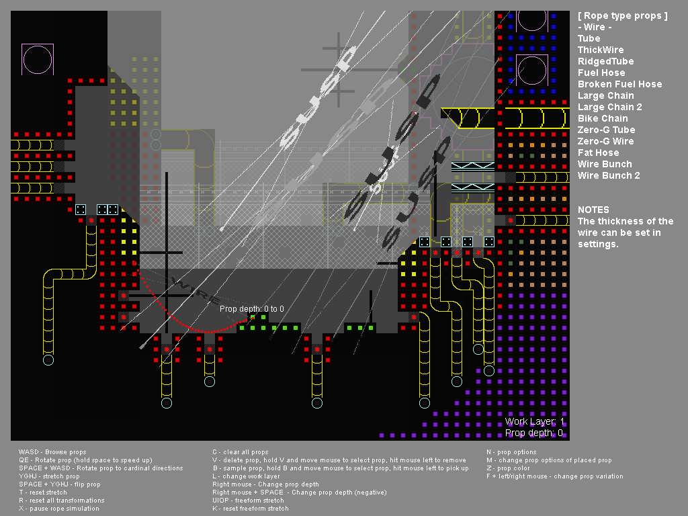

# Level Editor: Prop Editor

## ***<u>This article is a stub and needs to be updated!</u>***

## Controls:

---

- A, D - Changes prop library's category
- W, S - Scrolls through props in current category
- Mouse left - Place current prop
- V - Hold and click mouse left to remove highlighted prop
- Q, E - Rotate prop left and right
- Space - Hold to speed up rotation
- Y,G,H,J - stretch prop
- T - reset prop stretching
- R - reset stretching, and rotation
- Y,H - Only on wires/tube props, Increases or decreases prop's physics node count. Less means more taught, more means more loose
- X - Pause wire/tube physics
- Tab+X+C - clear all props
- B - Click mouse left to set the highlighted prop as the currently selected prop
- L - Change layer
- Mouse right - Change prop depth. (There are 10 depths per layer, and each layer counts as 10. So props on layer 2, would start at 10, and count to 19, before going back to 10. Changes the order that props are drawn on top of each other with.)
- Mouse right + Space - Same as above, except going down in depth instead of up.
- U, I. O, P - Holds a prop by three vertices, and allows you to move the last one with the mouse to stretch it in a freeform manner. ( U stretches top right, I bottom right, O bottom left, and P top left. )
- K - resets freeform stretching.
- N - allows proper properties to be changed. Things like forcing certain graffiti to be drawn instead of a random one.
- M - Click with mouse left, to change the highlighted prop's properties (does the same as above, except allows you to edit an already placed prop. )
- Z - Changes prop color
- F + Left or right mouse - Changes between prop variants. This only applies to certain props.
- B - Navigates the prop library to the selected prop.