# Making A Region From The Ground Up

So you want to make a region, but you have no clue where to start! The idea of modding something so big is certainly daunting! However, looking at everything in small repeatable pieces will let you work step by step until one day you'll suddenly have a finished region! However before that happens you need to learn some basics to get you started! Lets start with some terminology of the tools used!

- [Official level editor](../level-editor/Official-Level-Editor.html) - This is the tool given to the modding community by the Rain World developers. These are the actual tools used to make Rain World. However much of its features and hotkeys are difficult and quirky to work with at first, but given enough time and use, the editor becomes an extremely powerful tool.
- Unofficial level editor - This is a tool created by AndrewFM and Mikronaut to edit Rain World rooms before the official editor was released. While it lacks many features needed to make rooms. It does have the incredibly useful feature of being able to edit already exported rooms. As well as changing creature dens into doors, and vice versa.
- [Dev Tools](https://rain-world-modding.fandom.com/wiki/Dev_Tools) - These are in game tools Rain World uses for editing room visual effects, sounds, and triggers. As well as the regions map, and the various other specific configurations of your room!
- [World File](World-File-Format.html) - This controls how your region (or any other region!) binds rooms together. As well as creature spawns!
- Room settings text - These files are present for every room that you save a configuration for in the dev tools. It contains the placement of objects, sounds, room effects, and any other setting applied using the dev tools.

I will not be giving a full control outline for every editor in this tutorial. If you need the editor's controls, please see the full article on the specific tool you are using for their list of inputs and quirks. This article is an exercise in how to bring a level from an empty screen, to a fully fleshed out room. Largely following my own process. Don't be afraid to branch out and try weirder things as you get comfortable with the editor!

## IMPORTANT TERMS

---

Before we start. It is extremely important to understand a few things about Rain World! Even if you do not plan to make a whole region, or only want to dip your toes into modding. It is important to know these!

- The editors are used to make rooms. You will not be crafting your entire region in a single editor project. You will be making one room at a time.
- A region is a large collection of connected rooms. Using a [World File](World-File-Format.html) to setup data inside them.
- A room is three files that control how Rain World handles the walls of that room, the graphics of that room, and finally the effects and colors of that room.
- The editor can only export the collision and graphics for rooms, [Dev Tools](https://rain-world-modding.fandom.com/wiki/Dev_Tools) are used to set the colors and effects.
- Code edits are required if you want to have passage support for your region.
- This guide is mostly about how to build the rooms that make up a region. As linking rooms using the world file does not take such a massive guide to explain.
- You will need at least a single door in your room in order to test it, as well as link it to the rest of your region later.
- By default, the editor will create a room the correct size for a single screen, with a single camera already setup for you. This is why the guide assumes only a single screen to help you learn to use the editor. Be default, a single room is 72 x 43.

## Setting Up

---

Once you open the official editor for the first time. you will be greeted with a file select. It is advised to make a folder for your rooms to keep them organized before you open the editor. Use the arrow keys to navigate into that folder, and press N to make a new room. You will then be greeted with the editor's main menu.

### Saving, and name quirks:

Before we do anything, lets save our room. It is REQUIRED that you start all of your rooms names with a region prefix. You can check the Rain World, World folder for the regions in game. We will be using SU_ the prefix for outskirts, at least until we have several rooms for our region later, or you are confident enough to begin making rooms for your own region.

Secondly, NEVER use spaces. Always use an underscore _ to separate your name's sections. Examples of correct room names:

- SU_test01
- SU_myroom
- SU_my_room
- SU_another_room
- SU_lotsandlotsofroom15
- SU_A04

The developers often used the letter (A, B, C..., J...) after the underscore _ to track the number of cameras in the room (for non-shelter (S) rooms), but this is not required. Examples of actual rooms in the game:

- SU_A05 - small Outskirts room with 1 camera (A)
- SU_B08 - larger Outskirts room with 2 cameras (B)
- HI_C14 - wide Industrial Complex room with 3 cameras (C)
- CC_D01 - tall Chimney Canopy room with 4 cameras (D)
- SL_F01 - Shoreline room with 6 cameras (F)
- UW_J01 - huge room in The Wall with 10 cameras (J)

So now. You are ready to begin painting!

## A Blank Canvas

---

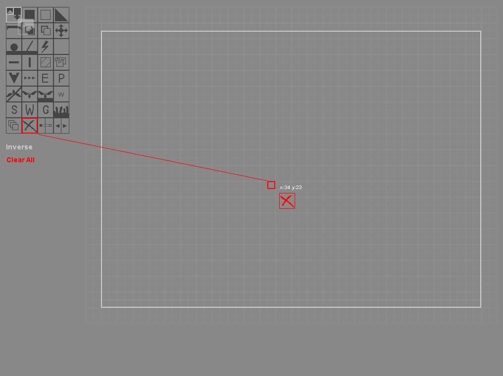

Click the geometry editor button to begin painting your level's basic geometry. However, before we do anything. We will first clear all the layer using the "clear all" tool. Use the arrow keys while the mouse is over the tile grid to change tools. Once the red box is over the X shaped tool. Used the numpad to navigate to the top left corner, click once to start drawing the rectangle of the clear tool, and navigate to the bottom right to place the other corner. When you are finished all the solid walls in the room will be removed. Leaving you with a completely blank canvas to work from.

A "fuzzy" grey border marks the very edge of a room. Where tiles no longer exist to the game. The white rectangle is the game play border Anything outside of this will repeat off into the distance, this ONLY applies to the room's collision. Visually they will be fine. All room in Rain World use these borders. For a more simple explanation. Keep everything related to gameplay inside the white rectangle! Anything outside will only show up visually, but will not act the same as they would inside the rectangle!

## Blocking It Out

---

Lets start painting out the shapes we want for our basic level! This seems like a bit sudden of a jump, but only a few moments of messing around in the editor will let you achieve what you see in the screenshot! Short cuts to doors and dens require walls to be placed in specific ways around them. The [Geometry Editor](../level-editor/Geometry-Editor.html) article goes into more depth about properly connecting short cuts, doors, and dens.

For now, we will simply place walls, some poles, and at least one "Entrance" to the room. The Dens seen in the screenshot are optional. Only one door is required for this tutorial.

## A Test Render...

---

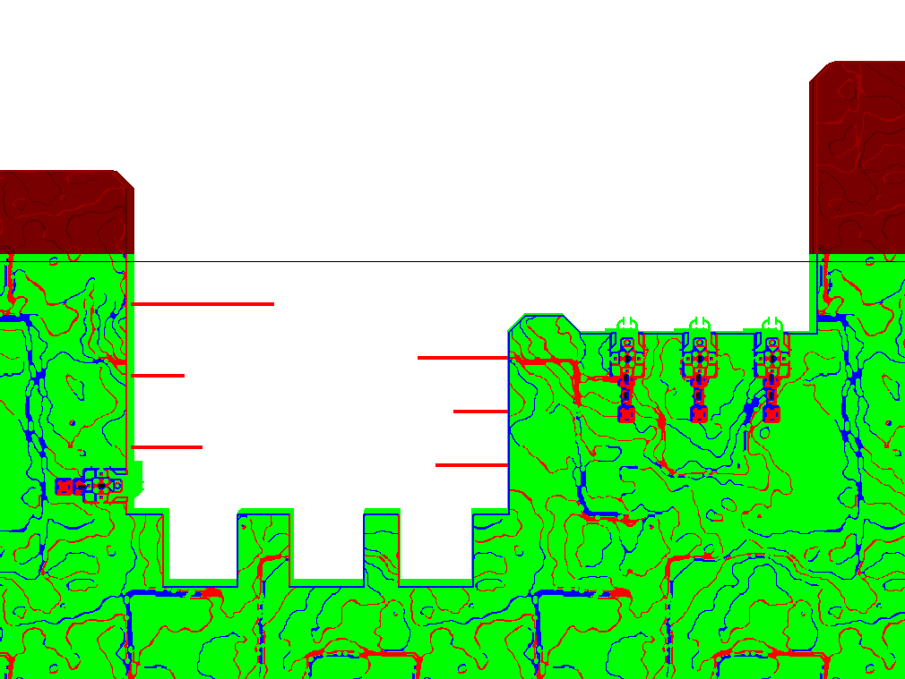

Before we move on; Lets do another save. So if anything goes wrong we won't lose the level geometry we now have. Press 1 on the number row to return to the main menu, and press the save button! Press enter in the name field to save the room without changing the name of it. It is now time to do a test render of our room so we can see if it plays correctly in game! First, we need to click "Text Output" to save the levels collision data, and then press "Render Level."

The editor will appear to freeze for a few moments. This is normal! Do not be worried, or attempt to close the editor! Eventually the editor will begin processing each layer of the room. Before it will render the rooms data into a red and black image. The files will be output into the "Levels" folder by the editor's executable.

The files ROOMNAME.txt and ROOMNAME_1.png are the exported version of your room, for use by Rain Worlds engine. Lets get to seeing our room in game!

## Our First Link

---

For now. We will be using outskirts as a quick way to test our room. We don't have our own region yet after all! There is already an easy to use DISCONNECTED door in outskirts, close to the start of the game. Lets move our room files to where they are needed!

First. Copy the ROOMNAME.txt and ROOMNAME_1.png files from the editor's level export folder. Then navigate to "Rain World\World\Regions\SU\Rooms". Inside you will see various other room files, and their settings file. For now, we will simply paste our room files into this folder.

Second. We will go one folder up. So we are inside the "SU" region folder. In here you will see Outskirt's World.txt file. The detail of this file are in this article: [World File Format](World-File-Format.html). However, for the purpose of this tutorial, we will be following the next steps to install our room to Outskirts!

Third. Open World_SU.txt. Inside we will see several door connections, creature spawns, and other region related data. Look for the line:

- SU_A63 : SU_B12, SU_A37, DISCONNECTED

This room has a disconnected door we can use to hook our room into easily! Lets add our room into the file! At the end of the end of the ROOMS section, but before the END ROOMS tag, add in our room's name. Followed by a : Then add SU_A63. This will link our door to SU_A63. My room's entry looks like this:

- SU_myroom : SU_A63

We now need to make sure SU_A63 connects to our room as well! We simply need to change DISCONNECTED into our rooms name. Mine looks like:

- SU_A63 : SU_B12, SU_A37, SU_myroom

We can now start Rain World! If this has all been done correctly. Then you will be able to load your file without it crashing to a grey screen. Simply navigate to SU_A63 to see the freshly added connection! You can peak into SU's "Rooms" folder, and find SU_A63_1.png to see what the room looks like to know where it is in game!

## ...Making Mistakes

---

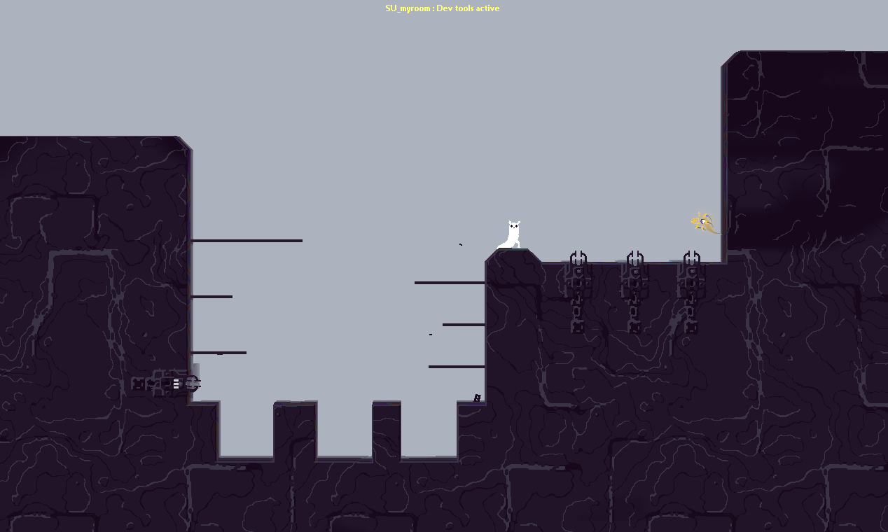

Our first room is pretty rough! Not everything will be perfect of course! This is a time to see if everything in our geometry works right! If pits are impossible to jump across, or if a jump is just a little our of reach. This is the time to tweak our level till we are happy with the layout. Render times are very fast with just a single layer and some walls after all! Don't be afraid of mistakes at this point. Just fix them and tweak until your room feels like it is playable, and there are no locations that you can become stuck in.

Repeat the steps above to edit, re-render, and re-install the room. You will no longer need to link the level to the world again! You only need to update the room files and image. You do not even need to close Rain World to test these changes. Simply dying, and returning to the room is enough to cause the room to reload for you to test the new collisions!

## A Start To Detailing

---

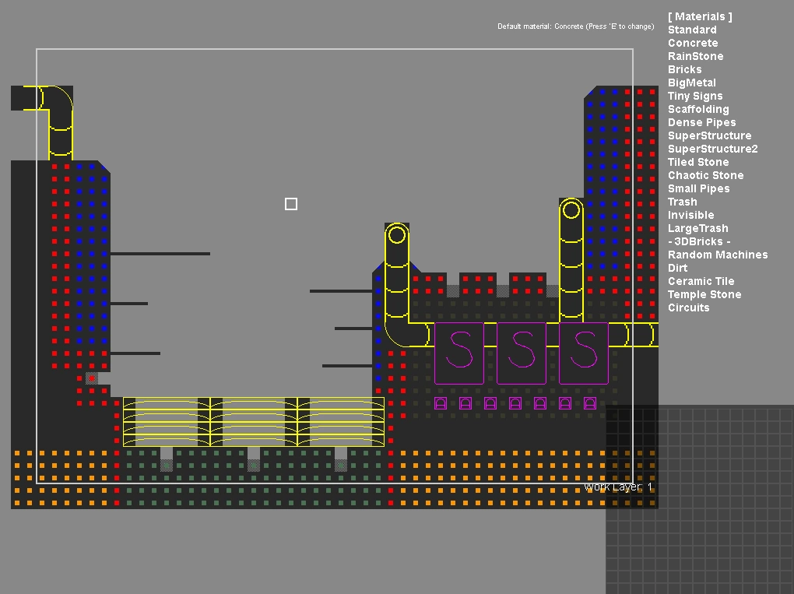

This looks like another crazy jump! But once you get used to the materials the editor gives you, the tile editor will become a playground, and you may even start designing your levels with it, and instead use the geometry editor just to compliment your tiles! It will all come to you as your understanding and comfort of the editor increases.

The details I've applied myself, have been to paint various materials in the same style Outskirts uses. Large metal plates surrounding dense pipes on corners. Concrete as the base material. The rare inclusion of pipes and machines. Along with a few things I enjoy using in my own levels. Such as large signs from the Misc category, and the insides of large pipes! The tile menu can be navigated using WASD keys. Many large tiles have a collision requirement. Holding G while clicking will automatically place the required geometry for you. This allows you to build things like pipes or complex machines without revisiting the geometry editor, or to construct rooms almost entirely out of tiles. However, you will still need to visit the geometry editor at some point for the bulk of your room's padding. Where you will paint the traditional tile "materials" over solid walls.

The colored dots in the picture are walls painted with a specific material. These are applied as the level is rendered! For now we are still just focusing on layer 1!

## A Second Render

---

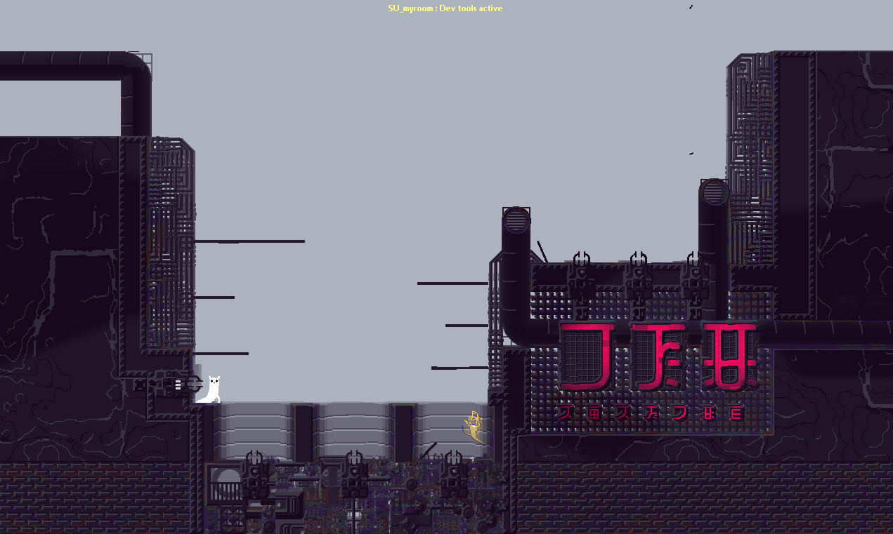

Things are starting to come together now! We can do a second little peak at how the room plays. After all, we've likely done some tweaks with our detailing.

Something is still missing however. Using only the first layer of Rain World's rooms can only give us so much detail! This level needs some DEPTH!

## Depth, and the Art of Backgrounds

---

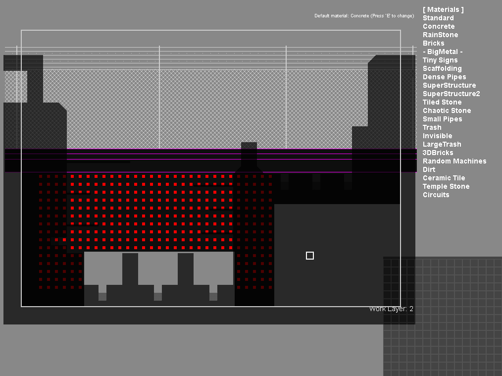

Lets head back into the editor! In the geometry editor, use the layer tool in the bottom left to change to layer 2, and paint over the places we want to place a "back wall" to our room! This layer is also one that creatures can climb on. Blue lizards often do this!

Some details on the first layer will also "bleed" into layers behind them. This happens most with the insides of pipes and large chimneys! You can see in the screenshot that I have not placed any layer 2 walls behind the pipe segments at the bottom of the room's vat area. I've done this so that the back wall will not cover over the inside of the pipes during the render! Once you are done painting, save, export text, and do a render! Lets do another test of how our level looks!

## A Third Render

---

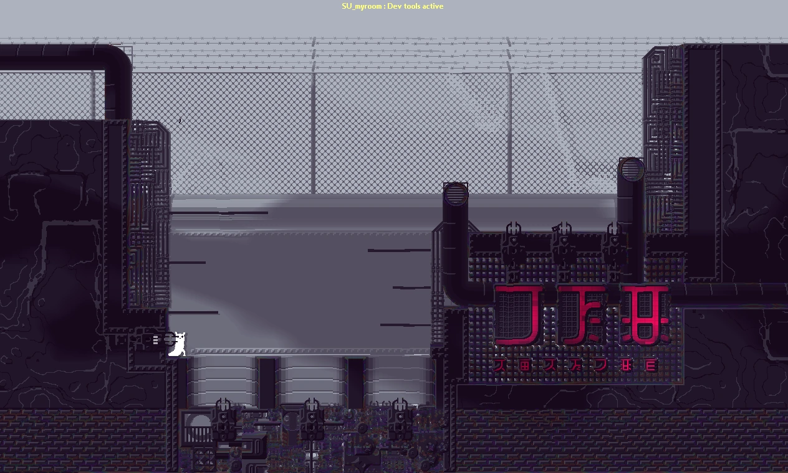

Yet another render, and more to see and tweak! We can fix any mistakes easily as we go. You can also skip each rendering step, and do all the layers at once if you are confident with the editor! I'll be doing a third layer, and correcting all the issues on layer 2 by the next section. All the info you need is in the official editor's article here: [Official Level Editor](../level-editor/Official-Level-Editor.html). There is also a large guide of all tiles and materials, and how they look once rendered here: https://imgur.com/a/Vz3Kk

The next steps involve tweaking, rendering, retweaking, and rerendering until you are happy with the base design of your level! Remember, that some creatures use layer 2 to climb on walls, but layer 3 is far enough in the background for nothing to interact with it! Layer 1 is solid to all creatures with few if at all exceptions. Make sure you cannot get trapped in your level!

## Effects and You

---

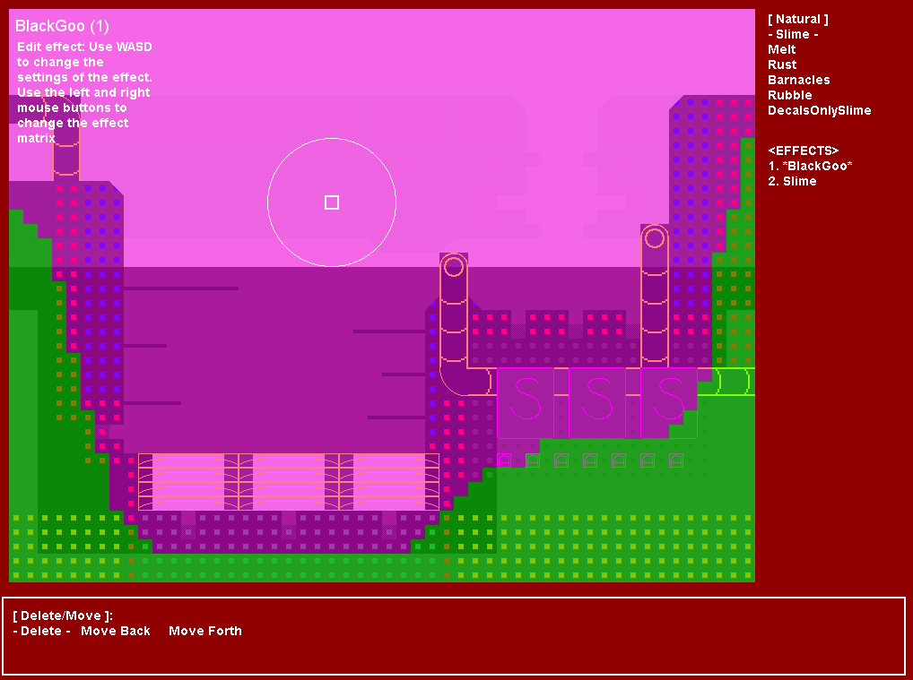

It's time to start painting! Now that you've solved any issues on your tile layers, and painted yourself a background layer. You are now ready to start painting effects! Remember though. Each effect slows down the render of the level quite a bit. From now on it will begin to get more time consuming to fix mistakes in the level! Especially once you start making larger rooms! Effects are what make Rain World rooms look special. They alter, distort, and deform your tiles. Grow plants, and even alter tiles entirely! The effects editor has an example image of every effect, and its basic usage outline in this article: [Effects Editor](../level-editor/Effect-Editor).

For the basics though! BlackGoo and Slime; These two effects are used in nearly every screen in Rain World to some degree! Slime makes every tile look slightly drippy and goopy. Like a mess has been rubbed onto them. BlackGoo forms the outer "shadow" of rooms. Both of these work together to make your room look less repetitive and clean!

## Yet another rendering

---

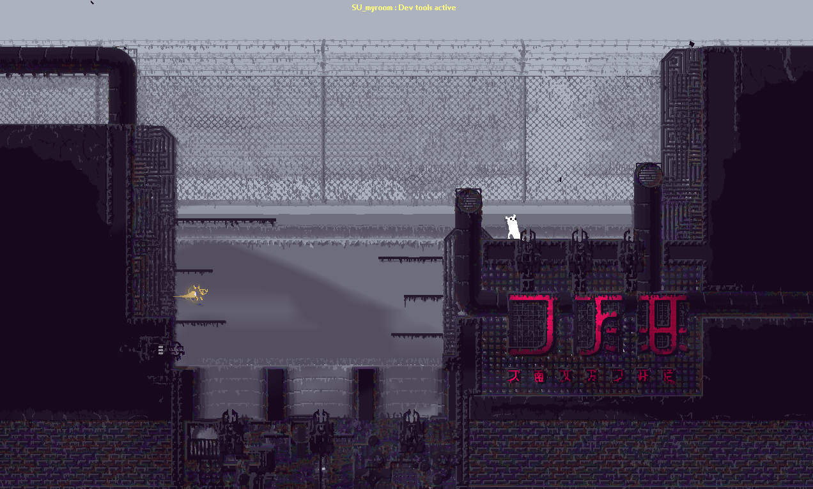

Look how far we've come! From an empty screen with nothing. To a room that feels like it is simply missing "something" before it is finished! Things like the brickwork along the sides passing over the BlackGoo( It only applies itself over certain materials!) can be corrected using large junk or dirt where you would want the BlackGoo down there.

You can also apply other effects till you are happy with the room. This includes everything from rubble, distortions, plants, and even daddy long leg corrupted walls! The only limits is your imagination to making effects work together, and the tiles you have to use! Once you've applied the effects you want, and have re-rendered till the level looks right. Next up is to add some props to our room!

## Fancy Props and Design

---

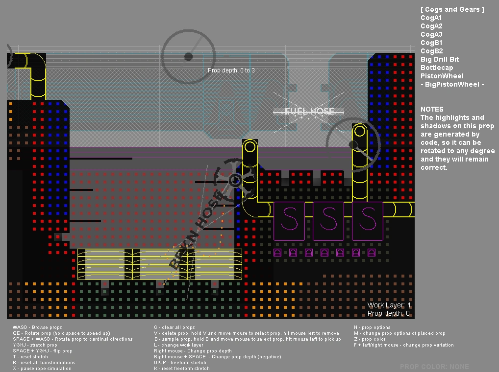

Remember to always save and keep backups! Some editor tabs can be more fussy then others!

Props are used to detail your room even further. Allowing you to place details without the grid, and at any angle and distorted shape you want! The control are outlined in the article here: [Prop Editor](https://rain-world-modding.fandom.com/wiki/Prop_Editor). While this is not too complex of a section. Adding a few proper can help break the rather straight geometry normally present in Rain World's levels by giving them some more curved shapes to look at. Such as tubes and valves between containers or machines!

Once you are all setup, we can render and move onto using the dev tools to configure the rooms more fine details! Remember. You can always re-render and re-export a level as many times as you need. At no point does a level become impossible to edit. With the one exception of losing its project save file!

## Dev tool configurations

---

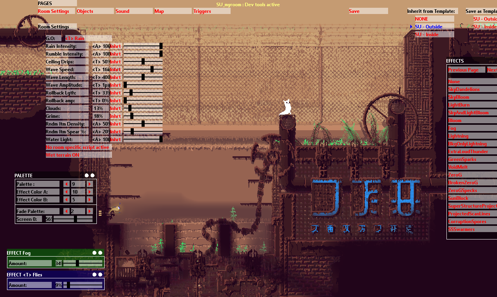

We can now move onto using the [Dev Tools](https://rain-world-modding.fandom.com/wiki/Dev_Tools) to configure the level's more detailed settings! Everything from the room's colors, effects, and even how the rain timer affects this room!

Want a section of outskirts with some kind of lightning machine? Go ahead! Want to make a flooding cave system? It's all in here! The room's palette is not tied to the region. However most regions have "templates" that you can use to automatically set room settings to. Instead of needing to do each room one by one the same way. You can change anything you need to away from the template default, or click "NONE" beneath in the template section to use purely your own settings.

The rooms palette can also be configured to fade between it, and another palette. Allowing you to configure the exact colors you would need. The various effects can also be configured to use Color1 or Color2 of the effect palettes. These are used to set the colors of plants. Giant signs, and even daddy long leg corruption!

Exploring the dev tools documentation will give you far more info and ideas then me directly telling you every possible situation. Remember that some objects and room settings require a reload of the room to appear! Don't forget to add sounds and some environmental ambience to flesh out your room, to make it feel like a unique location in this world!

*A very IMPORTANT notice! Be sure to click the save button before you reload the room* somehow! Or your changes will be lost! All of these configurations are save to ROOMNAME_settings.txt.

## Over and Over Again

---

The process of making a full region is filled with this! Making rooms from the ground up, detailing and configuring them, before linking another room onto the chain. The only real difference is that you are doing so from the gates of your own region, instead of a small room connected to the side of outskirts! There are already a few pages of documentation related to connecting in a new region yourself! The main one can be found here: [Adding new Regions](Adding-A-New-Region.html). The details of how to setup creatures and connections for the region are here: [World File Format](World-File-Format.html). Finally, the dev tool's map editor for making your region properly show as a map in game is here: [Map Tab](https://rain-world-modding.fandom.com/wiki/Map_Tab). I'll likely be expanding this guide at some point in the future, but for now this is the basics of how to create a room from scratch! Look through the other articles for things like: Raising the water level, setting up creature spawns, understanding doors, adding food, placing objects and plants, adding sounds and effects, specific room triggers, and the various special room settings!

And remember! Have fun!

## Why Do My Rooms Crash?

---

There are multiple reasons Rain World will dislike your rooms or connections. These are a few common, and more niche reasons why the game may be crashing.

### Doors outside of room bounds:

ALWAYS place every part of a short cut's path inside the room's boundary. Any short cut paths outside of it are ignored and will break the game when loaded. Crashing to a grey screen on file load.

### Accidental Doors and Dens:

The editor is a strange tool. It also has a second cursor in geometry mode... for some reason. An accidental key press may have placed a den, short cut entrance, or other kind of door in the room without proper connections. Take a peak over your room for any issues.

### Incorrect Region Prefix:

the prefix at the start of a room file should match the region you are placing it inside. For this guide we focus on tests rooms inside of outskirts ( SU_ ). If you are bringing these rooms to a custom region by renaming them, be sure to open the room's data file, and edit the first line to match the renamed version of the file.