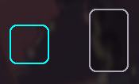
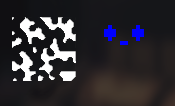
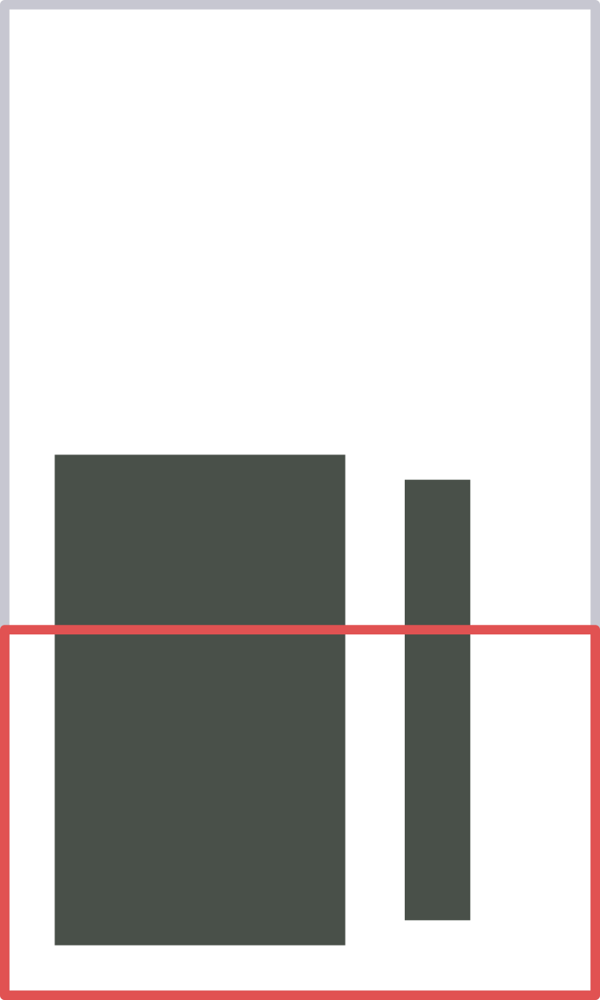

# Provided UIelements

This page explains what each provided `UIelement` is and how to use them.
You can check out the source code of Config Machine from its [github page](https://github.com/metnias/CompletelyOptional),
or have `ConfigMachine.xml` in your Reference folder for summaries.
However there are functions left unused (mainly because the modders are unaware) so this page will cover them.

This page is up to date with Config Machine `v1.5.1`.


---


## Table of Contents

1. [UIelement](##UIelement)
    1. [OpLabel](###OpLabel) & [OpLabelLong](####OpLabelLong)
    2. [OpRect](###OpRect)
    3. [OpImage](###OpImage)
    4. [OpScrollBox](###OpScrollBox)
    5. [OpContainer](###OpContainer)
2. [UIconfig](##UIconfig)
    1. [OpCheckBox](###OpCheckBox)
    2. [OpRadioButtonGroup](###OpRadioButtonGroup) & [OpRadioButton](####OpRadioButton)
    3. [OpDragger](###OpDragger)
    4. [OpSlider](###OpSlider) & [OpSliderSubtle](####OpSliderSubtle)
    5. [OpKeyBinder](###OpKeyBinder)
    6. [OpComboBox](###OpComboBox) & [OpResourceSelector](####OpResourceSelector) & [ListItem](####ListItem)
    7. [OpColorPicker](###OpColorPicker)
    8. [OpTextBox](###OpTextBox)
3. [UItrigger](##UItrigger)
    1. [OpSimpleButton](###OpSimpleButton) & [OpSimpleImageButton](####OpSimpleImageButton)
    2. [OpHoldButton](###OpHoldButton)
4. [Custom Classes](##Custom-Classes)
    1. [DyeableRect](###DyeableRect)
    2. [BumpBehaviour](###BumpBehaviour)
    3. [FTexture](###FTexture)
    4. [FCursor](###FCursor)
    5. [LabelText](###LabelText)
    6. [LoremIpsum](###LoremIpsum)


---


## UIelement

UIelement is everything that can be added in `OpTab`, which is 600x600 canvas.
Its sub-categories are [UIconfig](##UIconfig) and [UItrigger](##UItrigger).
UIelement can be either rectangular(pos and size) or circular(pos and rad),
although the vast majority of provided UIelements are rectangular.

(*Italic* properties call `OnChange` when it's modified)

|Property||
|:-|:-|
|*pos(setter)*|Sets bottom-left position *relative* to its canvas (`OpTab`/`OpScrollBox`).|
|*size*|The size of the element. (When this is rectangular)|
|*rad*|The radius of the element. (When this is circular)|
|description|Infotext that will be shown at the bottom of the screen when MouseOver is true.|
|MouseOver|Whether the mouse cursor is over this element.|

|Method||
|:-|:-|
|Hide()|Hides this UIelement, and prevent interaction.|
|Show()|Unhide this UIelement.|
|GetPos()|Returns bottom-left position *relative* to its canvas (`OpTab`/`OpScrollBox`). (pos(getter) returns *absolute* position)|
|Reset()|Reset this UIelement if it's possible.|
|FrameMultiply(origFrameCount)|(static) When you have a frame counter in Update, use this to accommodate with Many More Fixes' FPS unlock feature.|
|DTMultiply(deltaTime)|(static) Without MMF's FPS meddling, this returns somewhere close to `1f`. Use this for ticking gradual changes.|


### OpLabel


Simply displays text.

(*Italic* parameters are optional)

|Constructor Parameter|Displays text aligned to defined rectangular|
|:-|:-|
|pos|BottomLeft position relative from the canvas origin.|
|size|Width and height of the rectangle this UIelement occupies.|
|*text*|Text to be displayed. Setting it empty will generate Lorem Ipsum for testing.|
|*alignment*|Horizontal alignment, whether the text is align to left, center, right with the rectangle defined its size.|
|*bigText*|Whether to use bigger font or not.|

|Constructor Parameter|Displays text that goes right from the position|
|:-|:-|
|posX|Relative distance from the canvas origin to left side of the UIelement.|
|posY|Relative distance from the canvas origin to bottom side of the UIelement.|
|*text*|Text to be displayed. Setting it empty will generate Lorem Ipsum for testing.|
|*bigText*|Whether to use bigger font or not.|

|Property||
|:-|:-|
|*text*|Text to be displayed.|
|autoWrap|If true, when the text goes over its width, a linebreak will be inserted.|
|*alignment*|Horizontal alignment, whether the text is align to left, center, right with the rectangle defined its size.|
|*verticalAlignment*|Vertical alignment, whether the text is align to top, center, bottom with the rectangle defined its size.|
|bumpBehav|`null` by default. Setting this to other bumpBehaviour will synchronize highlighting. Creating new BumpBehaviour with this label turns itself reactive.|
|color|Colour of the text.|

#### OpLabelLong

A child class of [`OpLabel`](###OpLabel) that is specialized for displaying long wall of text.
This will always use smaller font.

|Constructor Parameter||
|:-|:-|
|pos|BottomLeft position relative from the canvas origin.|
|size|Width and height of the rectangle this UIelement occupies.|
|*text*|Text to be displayed. Setting it empty will generate Lorem Ipsum for testing.|
|autoWrap|If true, when the text goes over its width, a linebreak will be inserted.|
|*alignment*|Horizontal alignment, whether the text is align to left, center, right with the rectangle defined its size.|

|Property||
|:-|:-|
|allowOverflow|If false, text that goes over the height will be discarded.|


### OpRect



Simple rectangular, useful to make boundary to group UIelements.
Z-order is the order they're initialized, so for that purpose, initialize OpRect beforehand.

|Constructor Parameter||
|:-|:-|
|pos|BottomLeft position relative from the canvas origin.|
|size|Width and height of the rectangle this UIelement occupies.|
|*alpha*|Alpha of the background of rectangle.|

|Property||
|:-|:-|
|colorEdge|The colour of boundary sprites.|
|colorFill|The colour of fill sprites.|
|alpha|Alpha of the background of rectangle. If doesBump, this gets ignored.|
|doesBump|If true, this rectangle reacts to mouse cursor hovering .|
|bumpBehav|If doesBump, this controls reaction. If not, this stays `null`.|


### OpImage



Displays an image, whether it's `FAtlasElement` that's already loaded in `Futile.atlasManager`, or `Texture2D`.

|Constructor Parameter|Displays Texture2D|
|:-|:-|
|pos|BottomLeft position relative from the canvas origin.|
|image|Texture2D image to be displayed.|

|Constructor Parameter|Displays FAtlasElement|
|:-|:-|
|pos|BottomLeft position relative from the canvas origin.|
|fAtlasElement|The name of FAtlasElement.|

|Property||
|:-|:-|
|*color*|The colour of the sprite.|
|*anchor*|The anchor of the sprite. (0f, 0f) to set pos as BottomLeft, and (0.5f, 0.5f) to set pos as the center.|
|*scale*|The scale of the sprite.|
|*alpha*|The alpha of the sprite.|

You can change image without making new OpImage.
However, you cannot change Texture2D version to FAtlasElement and vice versa.

|Method||
|:-|:-|
|ChangeImage(newImage)|Swap image to new Texture2D.|
|ChangeElement(newElement)|Swap FAtlasElement to new one.|


### OpScrollBox

OpScrollBox is written by Slime_Cubed.
It's a special UIelement that acts as canvas, like OpTab.


|Constructor Parameter|Rectangular ScrollBox inside OpTab|
|:-|:-|
|pos|BottomLeft position relative from the canvas origin.|
|size|The size of the display.|
|contentSize|Internal length of the scroll direction.|
|*horizontal*|Whether this scrolls horizontally or vertically.|
|*hasBack*|Whether its boundary will have filled backdrop or not.|
|*hasSlideBar*|Whether this will have a scrollbar or not.|


|Constructor Parameter|ScrollBox that replaces OpTab|
|:-|:-|
|tab|BottomLeft position relative from the canvas origin.|
|contentSize|The size of the display.|
|*horizontal*|Whether this scrolls horizontally or vertically.|
|*hasSlideBar*|Whether this will have a scrollbar or not.|

Think of OpScrollBox as a window that displays larger canvas inside.
The size of this window is the same as `size`.
The size of the canvas inside has `contentSize` for its scroll-direction length,
and the other length matches the width of this window.



The diagram above would be coded like the following.
Their `pos` is relative to the bottom left origin of the canvas inside the OpScrollBox.
The result of this code is shown above.

```c#
OpScrollBox scb = new OpScrollBox(new Vector2(100f, 100f), new Vector2(240f, 150f), 400f);
Tabs[0].AddItems(scb); // Not required if you're using Tab version of constructor
scb.AddItems(new OpLabelLong(new Vector2(20f, 20f), new Vector2(120f, 200f)),
    new OpSlider(new Vector2(160f, 30f), "_", new IntVector2(-20, 20), length: 180, true, 10));
// Use AddItems on OpScrollBox instead of OpTab
```

|Property||
|:-|:-|
|redrawFlags|When this scrollbox should be redrawn. Never / Always(default) / OnHover / OnKeypress.|
|colorEdge|Edge colour of rectangles.|
|colorFill|Fill colour of rectangles.|
|fillAlpha|Fill alpha of boundary rectangle.|
|doesBackBump|If false, boundary rectangle does not react with mouse over.|
|ScrollLocked|Whether the scrolling is locked. Manipulated by `Lock` and `Unlock` method.|
|ScrollOffset|The visual offset, in pixels, of the contents of this scrollbox. (<=0)|
|MaxScroll|The value of `ScrollOffset` at the topmost or rightmost position of the box. (<=0)|
|targetScrollOffset|The target value of `ScrollOffset`. Change this to smoothly animate scrolling.|

|Method||
|:-|:-|
|AddItems(items)|Adds a collection of items to the interior of this scrollbox. Use this instead of `OpTab.AddItems` for its children.|
|Lock(stopImmediately)|Locks scrolling. If `stopImmediately`, ignore `targetScrollOffset` and stops immediately.|
|UnLock()|Unlocks scrolling.|
|ScrollToTop(*immediate*)|Scrolls to the top/leftmost. If `immediate`, scrolling animation gets cancelled.|
|ScrollToBottom(*immediate*)|Scrolls to the bottom/rightmost. If `immediate`, scrolling animation gets cancelled.|
|MarkDirty()|Forces redrawing at the end of this frame.|
|MarkDirty(time)|Forces redrawing for the amount of `time` in seconds.|


### OpContainer

This is basically an easy-to-access FContainer for ConfigMenu.

|Constructor Parameter||
|:-|:-|
|pos|The origin of this element relative to the canvas origin.|

|Property||
|:-|:-|
|container|Accessible FContainer. You can access this without checking isOptionMenu. (NullRef-proof)|

---

## UIconfig

`UIconfig` is a subcategory of UIelement, and has few extra properties and methods.
Their value gets saved in `ModConfigs` folder in json format.
If the key is either `null`, Empty, or starts with `_`,
it is considered `cosmetic` and its value won't be saved.

|Property||
|:-|:-|
|key|(readonly) Unique key to save the value.|
|*value*|The value that gets saved. `valueInt`, `valueFloat`, and `valueBool` exist which is useful for designing reactive GUI.|
|greyedOut|If true, the element gets greyed out visually and cannot be interacted with.|
|bumpBehav|`BumpBehaviour` instance this UIconfig has.|

|Method||
|:-|:-|
|ForceValue(newValue)|Change `value` without invoking `OnChange()`.|

### OpCheckBox


### OpRadioButtonGroup
#### OpRadioButton


### OpDragger

### OpSlider
#### OpSliderSubtle

### OpKeyBinder

### OpComboBox
#### OpResourceSelector
#### ListItem
While this technically belongs to [Custom Classes](##Custom-Classes),
this is currently only used in `OpComboBox` so it will be included here.

### OpColorPicker

### OpTextBox

---

## UItrigger


### OpSimpleButton
#### OpSimpleImageButton

### OpHoldButton


---

## Custom Classes


### DyeableRect

### BumpBehaviour

### FTexture

### FCursor


### LabelTest

### LoremIpsum


|Properties||
|:-|:-|
|*_init*|Whether this is initialized in ConfigMenu or not. The same as `OptionInterface.isOptionMenu`.|
|*menu*|Rain World Menu instance this element is belong to.|
|*owner*|Rain World Page instance this element is belong to.|
|*tab*|OpTab instance this element is in.|
|*subObjects*|`MenuObject` instances this element has.|
|*myContainer*|FContainer that this element has. It gets initialized in constructor *only* when `_init`.|
|*isHidden*|Whether this is hidden and not visible.|
|*fixedSize*|If this is not null, this element's size will always be this. (*fixedRad* does the similar)|
|*_soundFill*|Add number (in proportion with sound effect's length) to this whenever you're playing soundeffect.|
|*_soundFilled*|If this is true, avoid excuting `menu.PlaySound`|